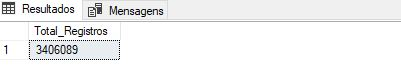

# 📊 Análise Completa de Vendas - Contoso Retail

## 🧠 Objetivo
Realizar uma análise completa das vendas da Contoso Retail utilizando apenas SQL no SQL Server, com foco em didática e clareza. 
Este projeto simula uma situação real onde a diretoria da empresa busca insights estratégicos para melhorar o desempenho comercial.

## 🏢 Contexto do Problema
Durante uma reunião trimestral, a diretoria da Contoso Retail identificou queda nas vendas em algumas regiões e a necessidade de entender melhor os produtos mais vendidos, as categorias mais lucrativas e tendências ao longo do tempo.

Eles contrataram um analista de dados (Eu) para explorar o banco de dados "ContosoRetailDW" e responder às principais perguntas de negócio com base nas informações de vendas.

## 🔧 Ferramentas e Técnicas
- SQL Server
- SQL Server Management Studio (SSMS)
- Comandos SQL: GO, COUNT, AVG, JOIN, WHERE, GROUP BY, CTE, DENSE_RANK, PARTITION BY 

## 📂 Tabelas Utilizadas
- FactSales: dados de vendas
- DimProduct: informações dos produtos
- DimProductSubcategory e DimProductCategory: hierarquia de produtos
- DimDate: datas das transações
- DimGeography: localização das vendas
- DimStore: vínculo entre vendas e localização

---

## 🔍 Etapas da Análise

### 1️⃣ Consulta Exploratória: Quantidade de Registros
Queremos entender a quantidade de dados disponíveis.

📷 Resultado:

---

### 2️⃣ Média de Vendas nos Estados Unidos
A diretoria quer entender como está o desempenho das vendas nos Estados Unidos, um dos principais mercados da Contoso.

📷 Resultado:

---

### 3️⃣ Top 10 Produtos Mais Vendidos por Categoria
Produtos com maior volume de vendas, agrupados por categoria, usando ranking interno (`DENSE_RANK`).

📷 Resultado:

---

### 4️⃣ Vendas por Mês (Tendência)
Entender como as vendas se comportaram mês a mês ao longo dos anos.

📷 Resultado:

---

### 5️⃣ Receita Total dos Produtos Mais Vendidos
A diretoria deseja saber quais categorias e subcategorias geram mais receita dentro do grupo dos produtos mais vendidos. Essa análise complementa o Top 10 mostrando seu impacto no faturamento.

📷 Resultado:

---

## ✅ Conclusão

- As vendas nos **Estados Unidos** estão dentro da média geral, mas há espaço para crescimento com estratégias regionais.
- Produtos da **categoria "Eletrônicos"** dominam o Top 10 em volume de vendas, com destaque para laptops.
- A tendência de vendas mostra **sazonalidade visível**, com possíveis quedas no inverno.
- A maior parte da **receita** vem das **subcategorias que contêm os produtos mais vendidos**, indicando um bom alinhamento entre volume e lucro. Foco nesses produtos pode ser uma estratégia eficiente.
